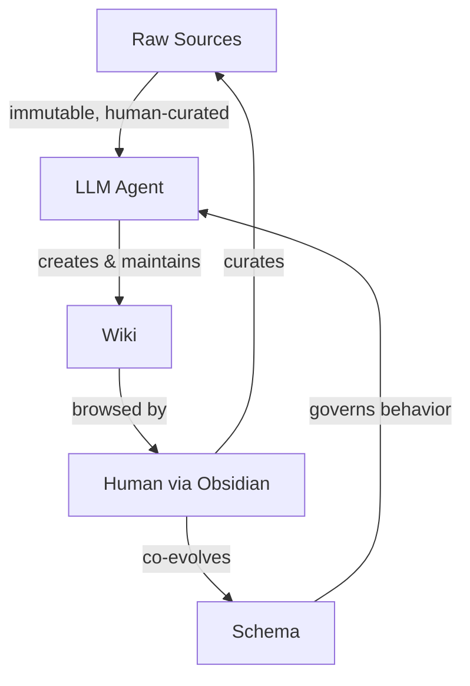

# LLM Knowledge Bases

A pattern for building personal or team knowledge bases where an LLM incrementally builds and maintains a persistent wiki from raw source documents. Introduced by [[Andrej Karpathy]] in April 2026 as an alternative to [[Retrieval-Augmented Generation]].

## Core Concept

Instead of re-deriving answers from raw documents on every query (the RAG approach), the LLM **compiles knowledge once** into a structured, interlinked wiki and then **keeps it current** as new sources arrive. The wiki is a persistent, compounding artifact — cross-references are already established, contradictions already flagged, synthesis already reflecting all ingested material.

The human curates sources, asks questions, and directs analysis. The LLM handles summarizing, cross-referencing, filing, and bookkeeping — the maintenance work that causes humans to abandon wikis.

## Architecture

Three layers with clear ownership:

1. **Raw sources** — immutable documents. The LLM reads but never modifies.
2. **The wiki** — LLM-generated markdown. Entity pages, topic summaries, comparisons, synthesis.
3. **The schema** — configuration file defining wiki structure, conventions, and workflows. Co-evolved by human and LLM.

## Operations

| Operation | Purpose | Trigger |
|-----------|---------|---------|
| **Ingest** | Process a new source into the wiki | New source added to raw/ |
| **Query** | Answer a question using the compiled wiki | Human asks a question |
| **Lint** | Health-check for contradictions, orphans, gaps | Periodic or on-demand |

A single ingest can touch 10-15 wiki pages. Good query answers should be filed back into the wiki so explorations compound alongside ingested sources.

## Comparison with RAG

| Aspect | RAG | LLM Wiki |
|--------|-----|----------|
| Knowledge persistence | None — re-derived per query | Compiled and maintained |
| Cross-referencing | On-the-fly at query time | Pre-established and maintained |
| Contradiction handling | Implicit / undetected | Explicitly flagged |
| Cost per query | High (retrieval + generation) | Lower (read compiled pages) |
| Upfront cost | Low (just index) | Higher (ingest processing) |
| Accumulation | No compounding | Compounds with every source |

## Applications

According to [[source-karpathy-llm-wiki|Karpathy's original gist]], the pattern applies to:

- **Personal** — goals, health, self-improvement, journal entries
- **Research** — deep-dives over weeks or months with evolving thesis
- **Reading** — companion wikis for books (characters, themes, plot threads)
- **Business/team** — internal wikis fed by Slack, meetings, project docs
- **Other** — competitive analysis, due diligence, trip planning, course notes

## Historical Context

The idea echoes [[Vannevar Bush]]'s [[Memex]] (1945) — a personal knowledge store with associative trails. Bush envisioned connections between documents as valuable as the documents themselves. The missing piece was who does the maintenance; LLMs solve that.

## Related

- [[Retrieval-Augmented Generation]] — the dominant alternative approach
- [[Obsidian]] — recommended frontend for browsing the wiki
- [[Andrej Karpathy]] — originated the pattern
- [[Memex]] — historical precursor
