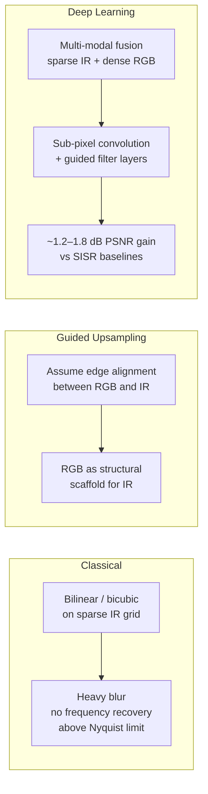
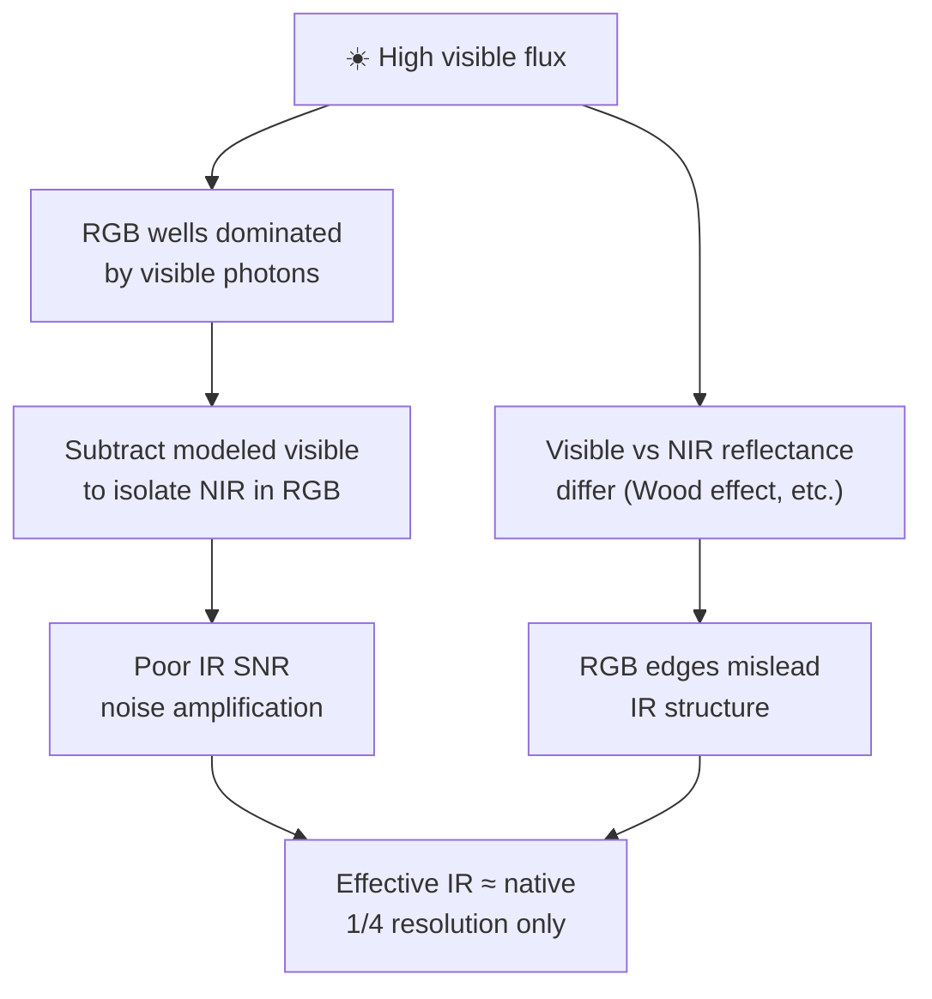

# RGB-IR Demosaicing

RGB-IR sensors embed dedicated near-infrared (NIR) pixels into a color filter array (CFA), typically using a 4×4 pattern instead of the standard 2×2 Bayer mosaic. This eliminates mechanical IR-cut switching and enables simultaneous, pixel-aligned RGB + IR video from a single lens — but at the cost of allocating only ~25% of the sensor to IR, making the native IR resolution one-quarter of total megapixels. Computational demosaicing and guided upscaling attempt to recover the missing spatial information, with results that vary dramatically depending on scene illumination. According to the source, the ~30% quality-gain cap in mixed lighting is theoretically sound and empirically validated.

## Sensor Architecture

Conventional cameras use a mechanical IR-cut filter to block NIR during daylight, then physically remove it for night mode. This creates latency, mechanical wear, and points of failure — especially problematic in automotive ADAS and continuous biometric surveillance.

RGB-IR sensors replace the mechanical assembly with a dual band-pass filter and expand the CFA from a 2×2 Bayer grid to a 4×4 pattern. A representative 4×4 tile:

| | Col 1 | Col 2 | Col 3 | Col 4 |
|------|:-----:|:-----:|:-----:|:-----:|
| **Row 1** | R | G | R | **IR** |
| **Row 2** | G | B | **IR** | B |
| **Row 3** | R | **IR** | R | G |
| **Row 4** | **IR** | B | G | B |

Four of the sixteen positions (25%) are dedicated to NIR. The remaining 75% capture RGB, but — critically — those RGB pixels also absorb NIR light that leaks through their organic dye filters. This leakage is both a contamination problem and an information source.

## Native Resolution Baseline

Per the Nyquist–Shannon sampling theorem, sub-sampling IR to one-quarter of the sensor destroys high-frequency spatial data irreversibly. Before any upscaling, the raw IR is sparse:

| Sensor | Total pixels | Native IR (~25%) | Native RGB (~75%) |
|--------|:-----------:|:----------------:|:-----------------:|
| 2.7 MP | ~2,700,000 | **~0.675 MP** | ~2.025 MP |
| 5 MP | ~5,000,000 | **~1.25 MP** | ~3.75 MP |

The 5 MP sensor exceeds the ~0.92 MP threshold for 720p-equivalent IR natively — the 2.7 MP sensor does not. According to the source, this baseline difference is decisive in daylight where upscaling algorithms lose effectiveness.

## Physics: NIR Leakage in RGB Pixels

Organic RGB filter dyes are highly transparent beyond ~800 nm. Without an IR-cut filter, the signal $S_c$ at any color pixel $c \in \{R, G, B\}$ is a superposition of visible and NIR contributions:

$$
S_c = \underbrace{\int_{400}^{700} I(\lambda)\, R(\lambda)\, Q(\lambda)\, T_c(\lambda)\, d\lambda}_{\text{visible (desired)}} + \underbrace{\int_{800}^{1050} I(\lambda)\, R(\lambda)\, Q(\lambda)\, T_c(\lambda)\, d\lambda}_{\text{NIR contamination}}
$$

where $I(\lambda)$ is illuminant spectral power, $R(\lambda)$ is scene reflectance, $Q(\lambda)$ is silicon quantum efficiency, and $T_c(\lambda)$ is the color filter transmittance.

The second integral is NIR contamination — but it also carries IR spatial structure. Guided upsampling algorithms exploit this: if RGB pixels embed IR data, they can serve as structural scaffolds to interpolate between sparse dedicated IR pixels.

**Limiting factor — longitudinal chromatic aberration:** refractive index varies with wavelength, so NIR focuses at a slightly different plane than visible light. The IR data embedded in RGB pixels is optically softer than the visible data, capping how much sharp high-frequency structure can be extracted.

## Algorithm Landscape

- **Classical interpolation** (bilinear/bicubic on sparse IR): severe blur; cannot recover frequencies above the sparse grid's Nyquist limit.
- **Guided upsampling**: uses the assumption that visible and IR share structural gradients — edges, contours, textures. Works when the assumption holds.
- **Deep models** (GIRRE, LapSRN-style, sub-pixel convolution networks): multi-modal fusion of sparse IR + dense RGB. Per the source, GIRRE-class approaches achieve ~1.2–1.8 dB PSNR over strong SISR baselines, correlating to ~20–30% perceptual MTF improvement.

## Scenario A: Active IR, No Visible Light (Dark Room)

When visible light is ~0 lux and the scene is lit by an active NIR emitter (850/940 nm VCSEL or LED array), the visible integral drops to zero. All RGB pixels become effectively monochromatic IR sensors — their organic dyes transmit NIR almost uniformly across R, G, and B channels.

The ISP performs gain normalization (correcting per-channel transmissivity differences) and mild smoothing rather than cross-modal hallucination. The entire sensor contributes IR data:

| Sensor | Native IR | Effective IR (dark room) |
|--------|:---------:|:------------------------:|
| 2.7 MP | 0.675 MP | **~2.5–2.6 MP** |
| 5 MP | 1.25 MP | **~4.7–5.0 MP** |

This is the **best case** — upscaling succeeds because the primary obstacle (visible light contamination) is absent.

## Scenario B: Bright Daylight (Algorithmic Collapse)

Under solar illumination, RGB pixel wells saturate with visible photons. Isolating the embedded NIR signal requires aggressive subtraction of modeled visible contributions — but the visible signal is orders of magnitude larger, so the resulting IR SNR is catastrophically poor.

Additionally, **spectral decorrelation** between visible and NIR reflectance breaks the guided upsampling assumption. The **Wood effect** is a clear example: green foliage absorbs visible red/blue light (appears dark) but strongly reflects NIR (appears bright white). Black synthetic fabrics may do the opposite. Blindly using visible edge gradients to sharpen IR produces false textures, hallucinations, and aliasing.

Effective IR collapses to native hardware limits:

| Sensor | Effective IR (daylight) |
|--------|:-----------------------:|
| 2.7 MP | **~0.675 MP** (sub-megapixel) |
| 5 MP | **~1.25 MP** (still > 720p) |

The 5 MP sensor survives daylight through brute-force baseline; the 2.7 MP sensor falls below usability thresholds for many machine vision tasks.

## The ~30% Cap in Mixed Lighting

Under twilight, overcast, or controlled indoor light, some cross-channel correlation survives. Per the source, the maximum quality gain is bounded at ~30%:

- Cross-modal SSIM/PSNR transfer hits a strict **asymptotic limit**.
- GIRRE-class networks achieve **~1.2–1.8 dB PSNR** gain → roughly **~20–30% MTF** improvement.
- Standard Bayer demosaicing itself loses ~30% effective resolution vs ideal monochrome — guided IR upscaling can at best **reclaim** a similar margin.
- Beyond 30%, algorithms produce **generative hallucination** — aesthetically plausible textures that don't physically exist. Unsafe for biometrics, ADAS, and security where ground-truth geometry is required.

Effective IR under mixed lighting:

$$
\text{2.7 MP:}\quad 0.675 \times 1.3 \approx \textbf{0.87 MP}
$$

$$
\text{5 MP:}\quad 1.25 \times 1.3 \approx \textbf{1.63 MP}
$$

## Vendor Landscape (5 MP Class)

Industry has converged on 5 MP as the minimum viable baseline for mission-critical RGB-IR. Key sensors:

| Vendor | Model | Pixel pitch | QE @ 940 nm | Key features |
|--------|-------|:-----------:|:-----------:|--------------|
| OmniVision | OX05B1S | 2.2 µm | 36% | **Nyxel** deep-silicon trenching; global shutter; automotive IMS |
| Sony | IMX775 | 2.1 µm | ≥ 35% | Pyramid pixel structure; **on-chip NIR subtraction + smart upscale**; hybrid rolling/global shutter; 110 dB HDR |
| STMicro | VD1940 / VB1943 | 2.25 µm | High | 3D-stacked BSI; **on-chip NIR smart upscale + RGB reshuffle**; ASIL-B automotive safety |

The trend is toward **on-sensor ISP** — performing NIR subtraction, demosaicing, and upscaling in silicon rather than on the host processor, reducing latency and noise amplification.

## Related

- [[LLM Knowledge Bases]] — the pattern this wiki follows
